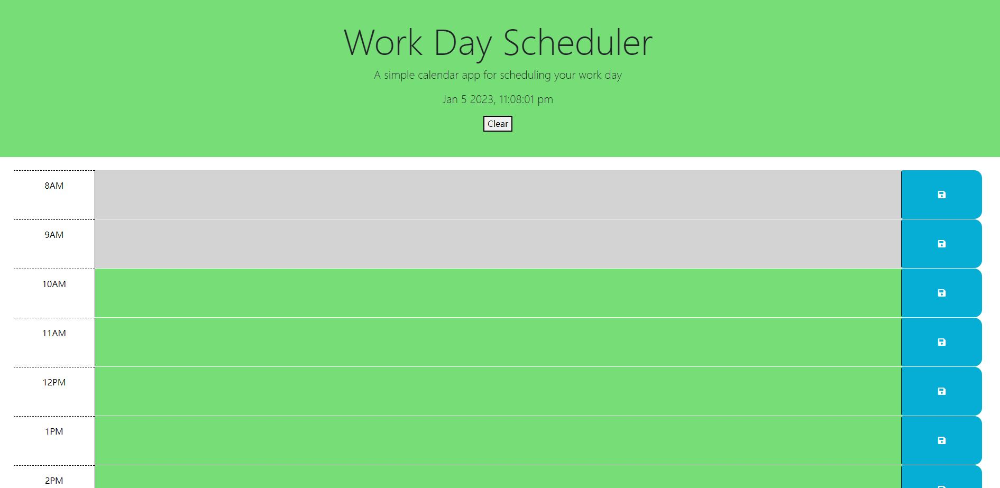

# Work-Day-Schedule

## Description

This page can be used to schedule the activities for a day from 8am to 6pm.

## Installation

N/A

## Usage

To use this scheduler, you can type activies in the time slot and click the save button on the rightside of each time slot, if you want to refresh the page and re-enter you can click the CLEAR button in the middle, shown in image below:

This will clear all the acticities and local storage.

## Credits

N/A

## License

MIT License

## Website
The URL is shown below: https://haozhe-h.github.io/Work-Day-Schedule/

